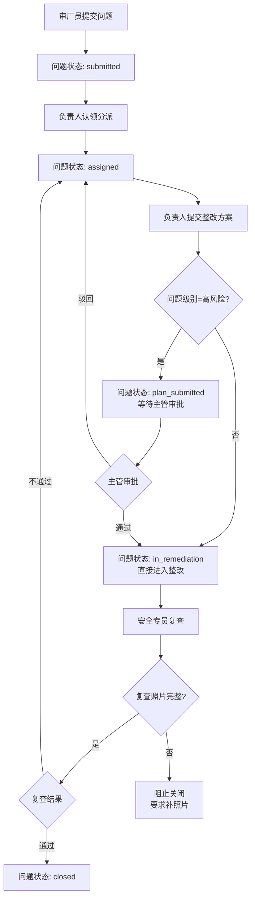
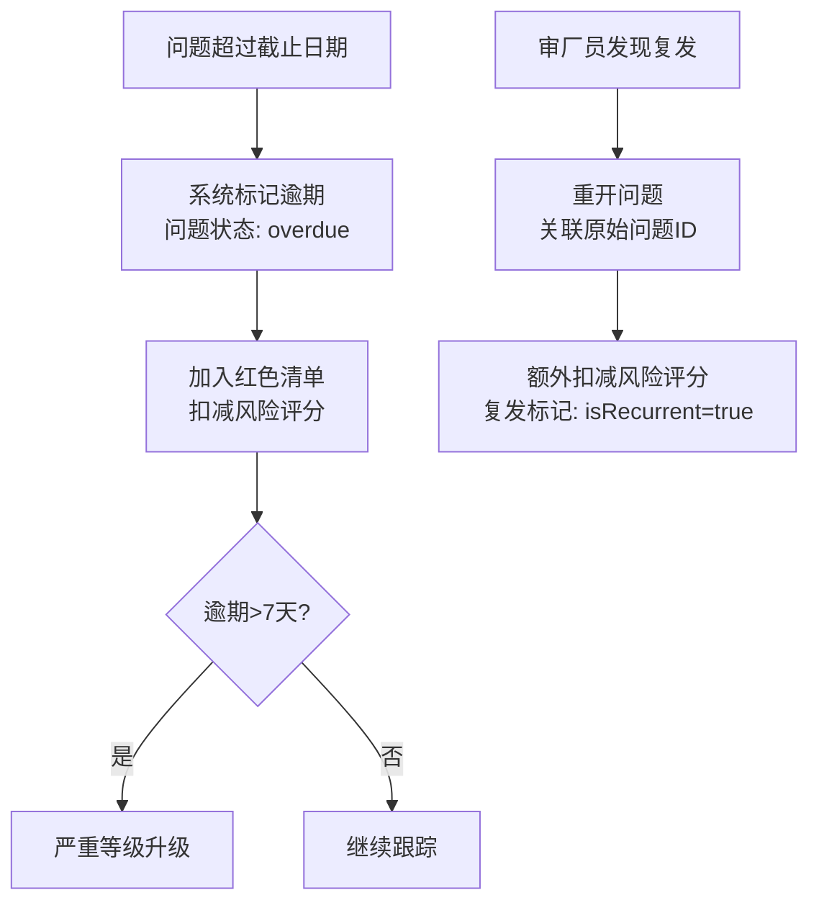
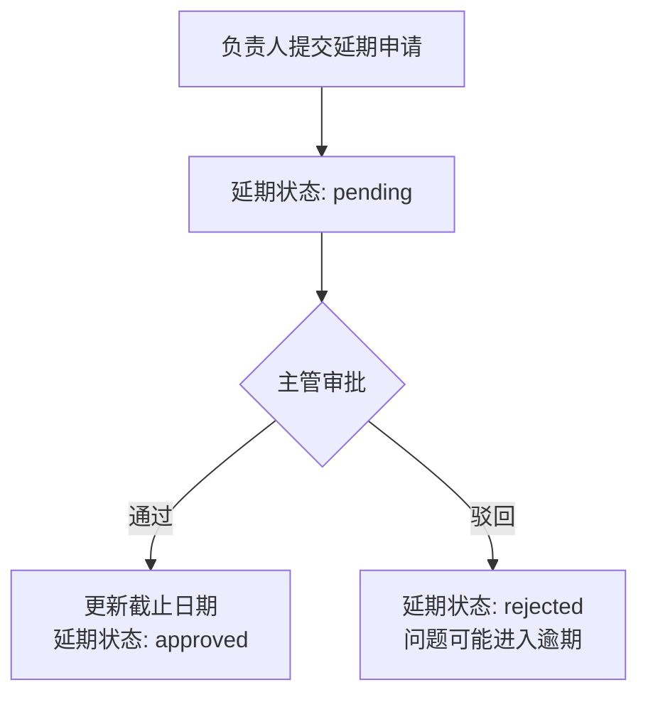

## 1. 产品概述

企业访厂安环整改闭环管理系统——让审厂员、企业负责人、安全专员和主管围绕同一批问题推进整改全流程，从问题提交、方案审批、整改执行、复查验证到闭环归档，确保高风险有审批、缺照片不关闭、逾期进红榜、复发可重开。

- 解决安环审厂整改过程中多角色协作混乱、审批缺失、证据不全、逾期失控、复发无法追溯的痛点
- 目标用户：制造业企业安环管理部门及其客户审厂团队

## 2. 核心功能

### 2.1 用户角色

| 角色 | 注册方式 | 核心权限 |
|------|----------|----------|
| 审厂员（auditor） | 系统分配 | 提交审厂问题、上传证据照片、标记客户确认要求、重开复发问题 |
| 企业负责人（responsible） | 系统分配 | 根因分析、提交整改方案与CAPA措施、指定责任人、申请延期 |
| 安全专员（safety） | 系统分配 | 上传复查计划、执行复查、上传复查照片、标记复查结果 |
| 主管（supervisor） | 系统分配 | 审批高风险整改方案、审批延期申请、查看全局报表 |

### 2.2 功能模块

1. **审厂问题端**：问题提交、法规条款关联、问题分级（高/中/低）、照片证据上传、客户确认要求勾选、问题列表与筛选
2. **负责人分派**：待分派问题认领、根因分析填写、整改方案提交、CAPA措施编写、责任人指定、延期申请
3. **安全复查**：复查计划创建、复查执行与结果录入、复查照片上传、照片缺失拦截关闭
4. **主管审批**：高风险方案审批、延期申请审批、审批意见填写
5. **逾期红榜**：逾期问题自动进入红色清单、风险评分扣减、逾期升级规则
6. **重复问题分析**：复发问题自动关联、复发重开操作、复发扣分机制
7. **整改闭环报表**：问题状态分布、分级统计、闭环率、平均整改时长、风险评分趋势

### 2.3 页面详情

| 页面名称 | 模块名称 | 功能描述 |
|----------|----------|----------|
| 审厂问题 | 问题提交表单 | 法规条款、问题分级、描述、照片证据上传、客户确认要求 |
| 审厂问题 | 问题列表 | 按状态/分级/逾期筛选，显示编号/标题/级别/状态/截止日 |
| 审厂问题 | 问题详情 | 问题版本历史、照片清单、整改方案、审批链、复查记录、审计日志 |
| 负责人分派 | 待处理列表 | 待分派/待提交方案的问题，按优先级排列 |
| 负责人分派 | 方案编辑 | 根因分析、整改方案、CAPA措施、责任人、截止日期、延期申请 |
| 安全复查 | 复查任务 | 待复查问题列表、复查计划日期、照片状态提示 |
| 安全复查 | 复查执行 | 上传复查照片、填写复查结果与备注、缺失照片时禁止关闭 |
| 主管审批 | 待审批列表 | 待审批的高风险方案和延期申请 |
| 主管审批 | 审批操作 | 查看方案详情、通过/驳回、填写审批意见 |
| 逾期红榜 | 红色清单 | 逾期问题列表、逾期天数、风险评分影响、自动升级状态 |
| 重复问题 | 复发关联 | 原始问题与复发问题对照、复发次数统计、重开操作 |
| 整改报表 | 闭环看板 | 状态分布饼图、分级统计、闭环率、平均整改时长、风险评分仪表盘 |

## 3. 核心流程

### 3.1 问题全生命周期

### 3.2 逾期与复发

### 3.3 延期流程

## 4. 用户界面设计

### 4.1 设计风格

- **主色调**：深石板色（slate-900）作为侧边栏与头部，琥珀色（amber-500）作为警示与高亮，翡翠绿（emerald-500）作为通过/完成，玫红（rose-500）作为逾期/高危
- **辅助色**：zinc-50/zinc-100 作为背景层次，zinc-400/zinc-500 作为文字辅助色
- **按钮风格**：圆角（rounded-lg），微妙阴影，hover 时 shadow-md 加深
- **字体**：系统字体栈，标题使用 font-semibold/text-lg，正文 text-sm，注释 text-xs
- **布局风格**：左侧固定侧边栏导航 + 右侧内容区，卡片式模块布局，表格列表为主
- **图标**：Lucide React 图标集

### 4.2 页面设计概览

| 页面名称 | 模块名称 | UI元素 |
|----------|----------|--------|
| 审厂问题 | 问题提交表单 | 白色卡片表单、法规条款输入框、分级选择器、照片上传区、客户确认开关 |
| 审厂问题 | 问题列表 | 表格+状态标签、分级徽章（红/黄/蓝）、逾期红色高亮行 |
| 负责人分派 | 方案编辑 | 多行文本区、日期选择器、责任人选择器、延期申请按钮 |
| 安全复查 | 复查执行 | 照片上传拖拽区、缺失照片红色警告、复查结果下拉选择 |
| 主管审批 | 审批操作 | 方案详情卡片、通过/驳回按钮组、审批意见文本框 |
| 逾期红榜 | 红色清单 | 红色背景行、逾期天数倒计时、风险评分扣减标签 |
| 整改报表 | 闭环看板 | 统计卡片组、环形图、趋势线、仪表盘 |

### 4.3 响应式

- 桌面优先设计，1280px 以上完整展示
- 平板端侧边栏收起为图标模式
- 移动端侧边栏变为底部标签栏

## 5. 样例场景覆盖

| 场景 | 描述 | 预期结果 |
|------|------|----------|
| 高风险审批 | 审厂员提交高风险问题ISS-011，负责人提交方案后等待主管审批 | 方案状态为plan_submitted，主管审批通过后才能进入in_remediation |
| 照片缺失 | 安全专员复查ISS-002时未上传复查照片 | 关闭按钮禁用，显示"请上传复查照片"提示 |
| 延期失败 | 负责人对ISS-003申请延期被主管驳回 | 延期状态rejected，问题进入overdue并加入红色清单 |
| 逾期升级 | ISS-004逾期超过7天 | 问题标记isOverdue=true，加入红色清单，风险评分额外扣减 |
| 复发重开 | 审厂员发现ISS-005与已关闭的ISS-006为同一问题复发 | 重开ISS-006，关联ISS-005为原始问题，扣减风险评分 |
