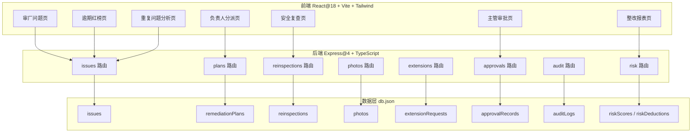
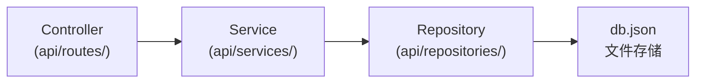
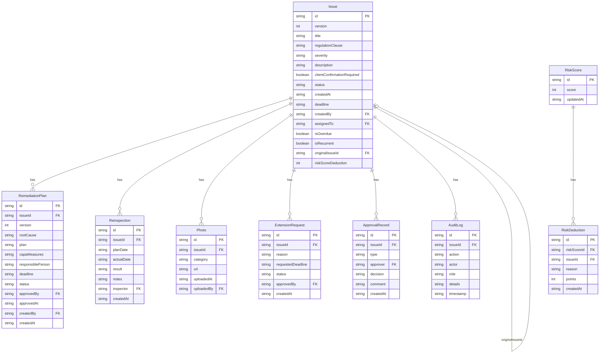

## 1. 架构设计



## 2. 技术说明

- **前端**: React@18 + Tailwind CSS@3 + Vite + React Router@7 + Zustand@5 + Lucide React
- **初始化工具**: vite-init
- **后端**: Express@4 + TypeScript (ESM)
- **数据库**: JSON 文件存储（db.json），使用低代码文件数据库模式
- **状态管理**: Zustand，全局 store 管理 API 数据和 UI 状态

## 3. 路由定义

| 路由 | 用途 |
|------|------|
| `/` | 首页仪表盘，展示统计概览和待办事项 |
| `/issues` | 审厂问题列表 |
| `/issues/new` | 提交新问题 |
| `/issues/:id` | 问题详情（含版本历史、方案、审批、复查、审计日志） |
| `/assignment` | 负责人分派待处理问题 |
| `/reinspection` | 安全复查任务列表 |
| `/approval` | 主管审批待处理列表 |
| `/overdue` | 逾期红榜 |
| `/recurrent` | 重复问题分析 |
| `/report` | 整改闭环报表 |

## 4. API 定义

### 4.1 问题管理

```typescript
// GET /api/issues - 获取问题列表（支持 status/severity/overdue 筛选）
// GET /api/issues/:id - 获取问题详情
// POST /api/issues - 创建问题
// PUT /api/issues/:id - 更新问题（版本+1）
// PUT /api/issues/:id/assign - 分派问题给负责人
// POST /api/issues/:id/reopen - 重开问题（复发）

interface Issue {
  id: string;
  version: number;
  title: string;
  regulationClause: string;
  severity: 'high' | 'medium' | 'low';
  description: string;
  clientConfirmationRequired: boolean;
  status: IssueStatus;
  createdAt: string;
  deadline: string;
  createdBy: string;
  assignedTo: string | null;
  isOverdue: boolean;
  isRecurrent: boolean;
  originalIssueId: string | null;
  riskScoreDeduction: number;
}

type IssueStatus = 
  | 'submitted' | 'assigned' | 'plan_submitted' 
  | 'in_remediation' | 'reinspection_in_progress' 
  | 'reinspection_passed' | 'overdue' | 'reopened' | 'closed';
```

### 4.2 整改方案

```typescript
// GET /api/plans?issueId=xxx - 获取问题的整改方案
// POST /api/plans - 提交整改方案
// PUT /api/plans/:id - 更新整改方案（版本+1）

interface RemediationPlan {
  id: string;
  issueId: string;
  version: number;
  rootCause: string;
  plan: string;
  capaMeasures: string;
  responsiblePerson: string;
  deadline: string;
  status: 'submitted' | 'approved' | 'rejected';
  approvedBy: string | null;
  approvedAt: string | null;
  createdBy: string;
  createdAt: string;
}
```

### 4.3 复查

```typescript
// GET /api/reinspections?issueId=xxx - 获取复查记录
// POST /api/reinspections - 创建复查记录
// PUT /api/reinspections/:id - 更新复查结果

interface Reinspection {
  id: string;
  issueId: string;
  planDate: string;
  actualDate: string;
  result: 'pending' | 'pass' | 'fail';
  notes: string;
  inspector: string;
  createdAt: string;
}
```

### 4.4 审批

```typescript
// GET /api/approvals?type=plan_approval&status=pending - 获取待审批记录
// POST /api/approvals - 创建审批记录（通过/驳回）
// POST /api/approvals/plan/:planId - 审批整改方案
// POST /api/approvals/extension/:extensionId - 审批延期申请

interface ApprovalRecord {
  id: string;
  issueId: string;
  type: 'plan_approval' | 'extension_approval';
  approver: string;
  decision: 'approved' | 'rejected';
  comment: string;
  createdAt: string;
}
```

### 4.5 延期

```typescript
// GET /api/extensions?issueId=xxx - 获取延期申请
// POST /api/extensions - 提交延期申请

interface ExtensionRequest {
  id: string;
  issueId: string;
  reason: string;
  requestedDeadline: string;
  status: 'pending' | 'approved' | 'rejected';
  approvedBy: string | null;
  createdAt: string;
}
```

### 4.6 照片

```typescript
// GET /api/photos?issueId=xxx&category=evidence - 获取照片列表
// POST /api/photos - 上传照片记录

interface Photo {
  id: string;
  issueId: string;
  category: 'evidence' | 'remediation' | 'reinspection';
  url: string;
  uploadedAt: string;
  uploadedBy: string;
}
```

### 4.7 审计日志

```typescript
// GET /api/audit?issueId=xxx - 获取审计日志

interface AuditLog {
  id: string;
  issueId: string;
  action: string;
  actor: string;
  role: string;
  details: string;
  timestamp: string;
}
```

### 4.8 风险评分

```typescript
// GET /api/risk - 获取风险评分与扣分明细

interface RiskScore {
  id: string;
  score: number;
  updatedAt: string;
}

interface RiskDeduction {
  id: string;
  riskScoreId: string;
  issueId: string;
  reason: string;
  points: number;
  createdAt: string;
}
```

## 5. 服务端架构图



## 6. 数据模型

### 6.1 数据模型定义



### 6.2 业务规则引擎

| 规则编号 | 规则名称 | 描述 |
|----------|----------|------|
| R001 | 高风险审批门控 | severity=high 的方案必须 supervisor 审批通过才能进入 in_remediation |
| R002 | 照片缺失关闭拦截 | 关闭问题时必须存在 category=reinspection 的照片记录 |
| R003 | 逾期自动升级 | deadline < now() 时自动标记 isOverdue=true，加入红色清单 |
| R004 | 逾期风险扣分 | 逾期问题按 severity 扣减风险评分（high:20, medium:10, low:5） |
| R005 | 复发重开扣分 | 重开问题时额外扣减风险评分（按原问题 severity 的2倍） |
| R006 | 延期驳回即逾期 | 延期申请被驳回后，若已过原 deadline 则立即进入逾期 |
| R007 | 审计不可变 | auditLogs 表仅追加，不修改不删除 |
| R008 | 版本递增 | 问题/方案更新时 version+1，保留历史版本 |
